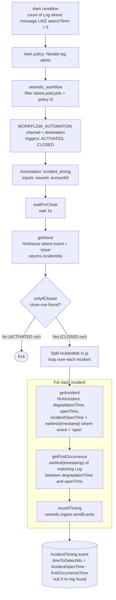

```mermaid
flowchart TD
    A["Alert condition<br/>count of Log where message LIKE searchTerm > 5"] --> B["Alert policy: Needle log alerts"]
    B --> C["newrelic_workflow<br/>filter labels.policyIds = policy id"]
    C --> D["WORKFLOW_AUTOMATION channel + destination<br/>triggers: ACTIVATED, CLOSED"]
    D --> E["Automation: incident_timing<br/>inputs: issueId, accountId"]

    E --> F["waitForClose<br/>wait 1s"]
    F --> G["getIssue<br/>NrAiIssue where event = 'close'<br/>returns incidentIds"]
    G --> H{"onlyIfClosed<br/>close row found?"}
    H -- "No (ACTIVATED run)" --> X(["Exit"])
    H -- "Yes (CLOSED run)" --> I["Split incidentIds in jq<br/>loop over each incident"]

    subgraph LOOP["For each incident"]
        direction TB
        J["getIncident<br/>NrAiIncident: degradationTime, openTime,<br/>incidentOpenTime = earliest(timestamp) where event = 'open'"]
        K["getFirstOccurrence<br/>earliest(timestamp) of matching Log<br/>between degradationTime and openTime"]
        L["recordTiming<br/>newrelic.ingest.sendEvents"]
        J --> K --> L
    end

    I --> J
    L --> M[("IncidentTiming event<br/>timeToDetectMs = incidentOpenTime - firstOccurrenceTime<br/>null if no log found")]
```